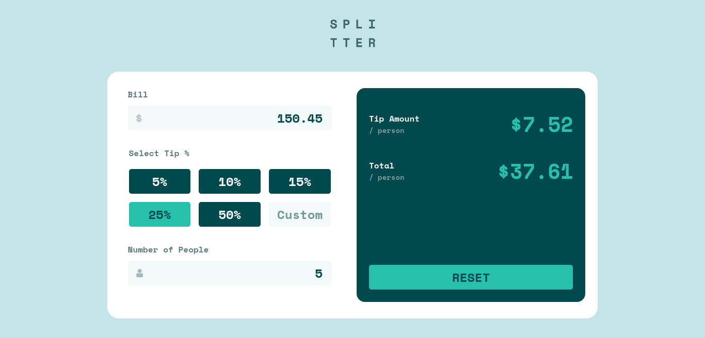

# Frontend Mentor - Tip calculator app solution

This is a solution to the [Tip calculator app challenge on Frontend Mentor](https://www.frontendmentor.io/challenges/tip-calculator-app-ugJNGbJUX). Frontend Mentor challenges help you improve your coding skills by building realistic projects.

## Table of contents

- [Overview](#overview)
  - [The challenge](#the-challenge)
  - [Screenshot](#screenshot)
  - [Links](#links)
- [My process](#my-process)
  - [Built with](#built-with)
  - [What I learned](#what-i-learned)
  - [Continued development](#continued-development)
  - [Useful resources](#useful-resources)
- [Author](#author)
- [Acknowledgments](#acknowledgments)

## Overview

### The challenge

Users should be able to:

- View the optimal layout for the app depending on their device's screen size
- See hover states for all interactive elements on the page
- Calculate the correct tip and total cost of the bill per person

### Screenshot

### Links

- [Solution URL](https://github.com/SArkar-Htet/tip-calculator-app)
- [Live Site URL](https://sarkar-htet.github.io/tip-calculator-app)

## My process

### Built with

- Semantic HTML5 markup
- CSS custom properties
- Flexbox
- CSS Grid
- Mobile-first workflow
- JavaScript
- Js DOM

### Useful resources

- [30 Days of JavaScript](https://github.com/Asabeneh/30-Days-Of-JavaScript) - This is a good challenge for beginners who's learning Js. This challenge improves your JavaScript skills.

## Author

- Frontend Mentor - [@SArkar-Htet](https://www.frontendmentor.io/profile/SArkar-Htet)
- Twitter - [@soearkarhtet](https://twitter.com/soearkarhtet)
